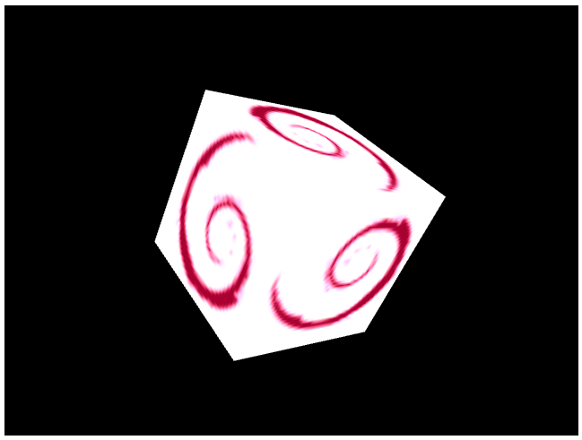

# WebGL over WebSocket from Python

A Python web server that controls [WebGL API](https://developer.mozilla.org/en-US/docs/Web/API) of the browser.
You can call WebGL API of a web browser that supports the API from a remote Python script.

Note that this is a proof of concept, and not recommended for production purpose. Especially it is not secured
at all. Any browser or Python script may connect to the server. 

# Run

Start the server.

```sh
pip install -r requrements.txt
uvicorn main:app
```

Open the URL from your browser. Chrome or Firefox for both desktop or mobile should work.
Then run the demo Python script.

```sh
python test.py
```



# How it works

- The web server runs on [FastAPI](https://fastapi.tiangolo.com/).
- The browser and the web server communicate over [WebSocket API](https://developer.mozilla.org/en-US/docs/Web/API/WebSockets_API) with
[JSON-RPC](https://www.jsonrpc.org/specification) like protocol.
- The demo script and the web server also communicate over WebSocket API.
